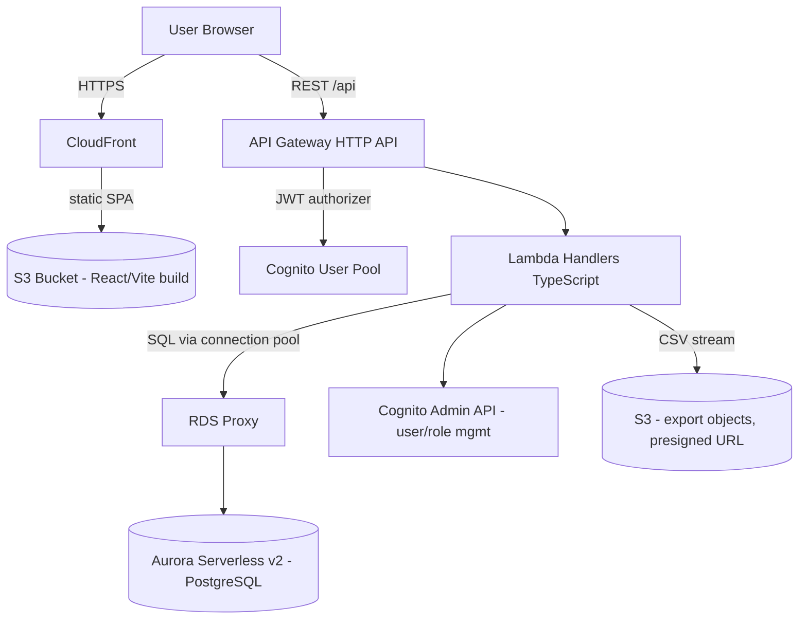
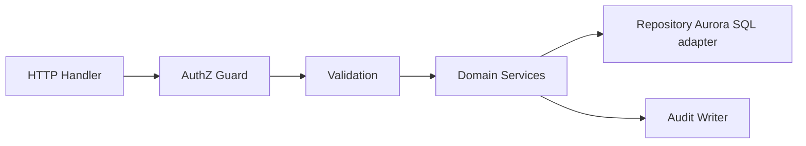
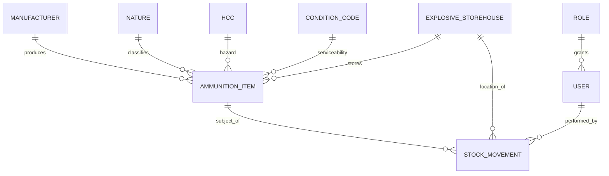

# Design Document: AIMS (Ammunition Information Management System)

## Overview

AIMS is a greenfield, multi-site web application for accountable, safety-focused management of
ammunition stockpiles in alignment with IATG-03.10 (Inventory Management) and IATG-01.40. This
document specifies the technical design for v1, covering the nine capability areas defined in the
requirements: ammunition inventory, manufacturer/reference data, hazard classification and NEQ
tracking, explosive storehouse (ESH) management with safety limits, condition/serviceability
tracking, ban/restriction management, stock movement and audit trail, reporting, and role-based
access control.

### Technology Choices

The system is deployed as a fully serverless AWS application to avoid always-on servers or
containers and to allow static hosting of the frontend. This decision was confirmed with the
stakeholder.

| Layer | Technology | Rationale |
|-------|-----------|-----------|
| Frontend | React + Vite (TypeScript), built to static assets | SPA served from object storage, no runtime server |
| Frontend hosting | Amazon S3 + CloudFront | Static hosting, TLS, caching, global edge |
| API | Amazon API Gateway (HTTP API) | Managed HTTPS entry point, JWT authorizer integration |
| Compute | AWS Lambda (Node.js 20, TypeScript) | Pay-per-use, no idle servers |
| Data store | Amazon Aurora Serverless v2 (PostgreSQL) | Relational engine natively fits AIMS's ad-hoc filtered lists (Req 1.9), grouped reports (Req 8.1–8.2), date-range queries (Req 8.3), and on-demand aggregation (`SUM(neq*quantity)`) without maintained counter items. Minimum capacity of 0 ACU enables auto-pause / scale-to-zero so idle compute cost is ~$0 (with a resume latency on the first request after idle). RDS Proxy sits in front to manage Lambda connection pooling. |
| Authentication | Amazon Cognito User Pools | Managed login, lockout, and token expiry (Req 9) |
| IaC | AWS CDK (TypeScript) | Reproducible multi-site deployment |

### Design Decisions and Rationale

- **Aurora Serverless v2 Postgres over a NoSQL store.** The original data model (`AIM_Latest.sql`,
  `Db_Layout.pdf`) is relational, and AIMS's core query patterns — ad-hoc filtered lists (Req 1.9),
  grouped/date-range reports (Req 8.1–8.3), and on-demand NEQ aggregation — map directly onto SQL.
  Aurora Serverless v2 keeps the serverless posture (no always-on server to manage) while giving a
  full relational engine. *(An earlier iteration of this design used DynamoDB with a single-table
  layout and maintained aggregate-counter items; it was replaced by Aurora because the relational
  engine computes these aggregates and filtered lists natively, removing the need to maintain and
  keep counters consistent.)*
  - **Aggregation (on demand, no counters).** Aggregate NEQ per storehouse is a
    `SELECT SUM(neq*quantity) ... GROUP BY storehouse_id`; the per-HCC breakdown adds
    `GROUP BY hcc_code`; mixed-hazard detection is `COUNT(DISTINCT hcc_code) >= 2`. These run on
    demand, so there are no maintained counter items to keep consistent (Req 3.5–3.7, 4.4–4.6,
    8.1–8.2), and they sit comfortably within the 10-second SLAs given the expected data volumes.
  - **Atomicity:** transfers and any multi-row movement run inside a single SQL transaction
    (`BEGIN`/`COMMIT`) with row-level locking (`SELECT ... FOR UPDATE`) on the affected items, giving
    all-or-nothing writes across source item, destination item, movement, and audit rows — satisfying
    transfer atomicity and rollback (Req 7.5–7.7).
  - **Scale-to-zero:** a minimum capacity of 0 ACU lets Aurora auto-pause when idle, so idle compute
    cost is ~$0 (at the cost of a resume latency on the first request after an idle period). **RDS
    Proxy** sits between the Lambdas and Aurora to pool and reuse database connections, avoiding
    connection exhaustion under Lambda concurrency.
- **Cognito for authentication.** Cognito User Pools provide credential verification, configurable
  account lockout after repeated failures, and token expiry — directly mapping to Req 9.8 (5-attempt
  lockout, ≥15 min) and Req 9.9 (15-min inactivity expiry). Authorization (role → permission) is
  enforced in the API layer, keyed off a role claim.
- **Append-only audit trail via SQL grants.** Audit rows are `INSERT`-only: the application database
  role is granted only `INSERT`/`SELECT` (no `UPDATE`/`DELETE`) on the `audit_record` table, and a
  trigger or explicit `REVOKE` additionally blocks modification, so no code path can alter or remove
  an audit row (Req 7.9).

### IATG-Aligned Additions

The following capabilities were flagged during requirements as IATG-aligned additions beyond the
original spreadsheet-style data model. This design handles each explicitly:

| Addition | Where handled | Requirements |
|----------|---------------|--------------|
| Per-storehouse NEQ limits | `explosive_storehouse.neq_limit`, on-demand aggregate query (`SUM(neq*quantity) GROUP BY storehouse_id`), capacity view | 4.1–4.5 |
| Mixed-hazard (distinct HCC) detection | `COUNT(DISTINCT hcc_code) >= 2` per storehouse; distinct-HCC set on storehouse view | 4.6 |
| Serviceability gating on issue | `condition_code.serviceable` flag checked before issue movements | 5.5 |
| Transfer atomicity / rollback | SQL transaction (`BEGIN`/`COMMIT`, `SELECT ... FOR UPDATE`) — all-or-nothing | 7.5–7.7 |
| Auth lockout and session expiry | Cognito lockout + token/inactivity expiry | 9.8–9.9 |
| Append-only audit trail | INSERT/SELECT-only DB grants on audit_record (no UPDATE/DELETE) + trigger/REVOKE | 7.9 |

## Architecture

### System Context



### Request Flow

1. The browser loads the React SPA from CloudFront/S3.
2. The user authenticates against Cognito; the SPA receives a JWT access token carrying `sub`
   (user id) and a `role` claim.
3. API calls go to API Gateway with the token in the `Authorization` header. A JWT authorizer
   validates the token and rejects unauthenticated requests (Req 9.1) before invoking any handler.
4. The target Lambda handler runs an authorization check (role → permitted action) and then the
   business logic against Aurora (via RDS Proxy) using SQL. Denials are recorded in the audit trail
   (Req 9.3, 9.4, 9.10).

### Logical Layering (inside each Lambda)

Handlers are thin; business rules live in a shared domain layer so they are unit- and
property-testable independently of AWS:



- **Domain Services** are pure TypeScript (no AWS SDK) where possible — validation, NEQ math,
  quantity math, ban/serviceability rules. This is the layer property-based tests target.
- **Repository** encapsulates all Aurora (SQL) access and transaction assembly behind the existing
  store-agnostic `Repository` interface (unchanged by this design).
- **Audit Writer** appends audit records within the same SQL transaction as the state change it records.

## Components and Interfaces

The API is organized into modules mapping to the nine requirement areas.

### 1. Ammunition Inventory (Req 1, 5)
- `POST /ammunition` — create item (validation of Identifier length, Quantity/NEQ bounds, required fields; Req 1.1–1.5)
- `PUT /ammunition/{id}` — update item; writes audit entry (Req 1.6, 1.7)
- `GET /ammunition` — list with filters `manufacturer, nature, storehouse, conditionCode, identifier` (Req 1.8, 1.9, 5.4)
- `DELETE /ammunition/{id}` — allowed only when Quantity == 0 (Req 1.10, 1.11)
- `PATCH /ammunition/{id}/condition` — change Condition_Code with before/after audit (Req 5.3)

### 2. Manufacturer & Reference Data (Req 2)
- `POST/DELETE /manufacturers`, `/natures`, `/hcc`, `/condition-codes`
- Duplicate detection is case-insensitive (Req 2.8); delete is blocked when referenced, returning the referencing count (Req 2.6). Reference lookups feed the item editor's constrained choices (Req 2.7).

### 3. Hazard Classification & NEQ (Req 3)
- Validation service enforces HCC exists and NEQ bounds/precision (Req 3.1–3.4).
- `GET /storehouses/{id}/neq` — aggregate NEQ (Req 3.5, 3.6)
- `GET /storehouses/{id}/neq/breakdown` — aggregate NEQ grouped by HCC (Req 3.7)

### 4. Explosive Storehouse & Safety (Req 4)
- `POST /storehouses` (Admin) with name + NEQ_Limit validation (Req 4.1–4.3)
- `GET /storehouses/{id}` — returns aggregate NEQ, NEQ_Limit, remaining capacity, and mixed-hazard indicator listing distinct HCCs (Req 4.5, 4.6)
- NEQ-limit exceedance produces a warning but still records the movement (Req 4.4).

### 5. Ban & Restriction (Req 6)
- `POST /ammunition/{id}/ban` / `DELETE /ammunition/{id}/ban` (Safety_Officer)
- Enforces Ban_Text 1–500 chars, already-banned / not-banned guards, and audit logging (Req 6.1–6.6). Ban blocks issue/transfer movements (Req 6.4).

### 6. Stock Movement & Audit (Req 7)
- `POST /movements` — type `receipt | issue | transfer | disposal`
- Quantity bounds, insufficient-stock, same-storehouse-transfer guards (Req 7.1–7.6); transfers are atomic with rollback (Req 7.7); every movement appends an audit record (Req 7.8).
- `GET /audit?ammunitionId=|storehouseId=` — newest-first, empty-set message (Req 7.10, 7.11).

### 7. Reporting (Req 8)
- `GET /reports/stockpile-summary` — totals by storehouse, Nature, Condition_Code (Req 8.1, 8.2)
- `GET /reports/movements?start=&end=` — date-range validation ≤366 days, start ≤ end (Req 8.3–8.5)
- `GET /reports/bans` — banned items with Ban_Text (Req 8.8)
- `?format=csv` on any report streams a CSV: exactly one header row + one row per record (Req 8.6, 8.7)

### 8. User Access & AuthZ (Req 9)
- `POST /users`, `PUT /users/{id}/role` (Admin) — role assignment/revocation applied on next request (Req 9.2, 9.7)
- Auth events (success, failure, denial) are audited (Req 9.5, 9.8, 9.10).

### Role → Permission Matrix (Req 9.2–9.4)

| Action | Inventory_Manager | Safety_Officer | Auditor | Administrator |
|--------|:---:|:---:|:---:|:---:|
| Create/update/delete Ammunition_Item | ✅ | | | |
| Record Stock_Movement | ✅ | | | |
| Manage HCC / NEQ limits / storehouses | | ✅ | | ✅ |
| Apply/remove bans | | ✅ | | |
| Read inventory / reports / audit | ✅ | ✅ | ✅ | ✅ |
| Manage users & reference data | | | | ✅ |

## Data Models

### Relational Schema (PostgreSQL)

The schema is a normalized relational model. Reference tables (`manufacturer`, `nature`, `hcc`,
`condition_code`) are referenced by `ammunition_item` via foreign keys; `stock_movement` and
`audit_record` capture the movement and audit trail. Aggregation (NEQ per storehouse, per-HCC
breakdown, mixed-hazard) is computed on demand with SQL aggregate queries — there are no maintained
aggregate tables.

**Tables**

| Table | Primary key | Key columns | Foreign keys |
|-------|-------------|-------------|--------------|
| `manufacturer` | `id` (uuid) | `name`, `addr1`, `addr2`, `city`, `state`, `postal_code`, `country` | — |
| `nature` | `id` (uuid) | `name` | — |
| `hcc` | `code` (text) | `code`, `description` | — |
| `condition_code` | `code` (text) | `code`, `description`, `serviceable` (boolean) | — |
| `explosive_storehouse` | `id` (uuid) | `name`, `street`, `city`, `state`, `postal_code`, `country`, `neq_limit` (numeric(14,2)) | — |
| `ammunition_item` | `id` (uuid) | `identifier` (text), `quantity` (integer), `neq` (numeric(12,2)), `ban_status` (boolean), `ban_text` (text) | `manufacturer_id`→`manufacturer`, `nature_id`→`nature`, `hcc_code`→`hcc`, `condition_code`→`condition_code`, `storehouse_id`→`explosive_storehouse` |
| `stock_movement` | `id` (uuid) | `type` (text: receipt/issue/transfer/disposal), `quantity` (integer), `timestamp` (timestamptz) | `item_id`→`ammunition_item`, `from_esh`→`explosive_storehouse` (nullable), `to_esh`→`explosive_storehouse` (nullable), `user_id`→`app_user` |
| `audit_record` | `id` (uuid) | `action` (text), `timestamp` (timestamptz), `details` (jsonb) | `user_id`→`app_user`, `item_id`→`ammunition_item` (nullable), `storehouse_id`→`explosive_storehouse` (nullable) |
| `app_user` | `id` (uuid; Cognito `sub`) | `role` (text), `status` (text) | — |

**Indexes** (chosen for the query patterns)

- `ammunition_item(storehouse_id)` — list/filter by storehouse; drives per-storehouse aggregation (Req 1.9, 3.5).
- `ammunition_item(manufacturer_id)`, `ammunition_item(nature_id)`, `ammunition_item(condition_code)` — filtered lists (Req 1.9, 5.4).
- `ammunition_item(identifier)` — identifier filter/lookup (Req 1.9).
- `stock_movement(timestamp)` — date-range movement reports, newest-first ordering (Req 8.3).
- `stock_movement(item_id)` — per-item movement/audit history (Req 7.10).
- `audit_record(item_id)` — audit query by item (Req 7.10).
- `audit_record(storehouse_id, timestamp)` — audit query by storehouse, newest-first (Req 7.10, 7.11).
- Case-insensitive uniqueness for duplicate detection (Req 2.8) is enforced with unique indexes on
  `lower(name)` / `lower(code)` for `manufacturer`, `nature`, `hcc`, and `condition_code`; reference-in-use
  checks (Req 2.6) use the foreign keys above (count of referencing `ammunition_item` rows).

### Entity Relationship (conceptual)



### Field Constraints (from requirements)

| Field | Constraint | Requirement |
|-------|-----------|-------------|
| Identifier | 1–64 chars | 1.1 |
| Quantity | integer 0–999,999,999 | 1.1, 1.3, 1.4 |
| NEQ (item) | 0.00–999,999.99 kg, 2 dp | 3.3, 3.4 |
| Movement quantity | 1–999,999,999 | 7.1, 7.4 |
| Manufacturer name | 1–200; country 1–100; others ≤200 | 2.1, 2.9 |
| Nature name | 1–200 | 2.3 |
| HCC / Condition code | 1–50; description 1–500 | 2.4, 2.5 |
| Storehouse name | 1–100; NEQ_Limit 0–999,999,999.99 | 4.1–4.3 |
| Ban_Text | 1–500 chars | 6.1, 6.2 |

### Key Algorithms

**Aggregate NEQ (SQL aggregate).** Aggregate NEQ for a storehouse is computed on demand:
`SELECT SUM(neq * quantity) FROM ammunition_item WHERE storehouse_id = $1` (rounded to two decimal
places; `0.00` for an empty storehouse). The per-HCC breakdown adds `GROUP BY hcc_code`. No counters
are maintained, so the reported value is always exactly the recomputed `Σ(neqᵢ × quantityᵢ)`
(verified by property test).

**NEQ limit check (Req 4.4).** After computing the post-movement aggregate, if it exceeds
`neqLimit`, the movement is still committed and a warning payload `{resultingAggregateNeq, neqLimit}`
is returned. This is a warning, not a rejection.

**Mixed-hazard detection (Req 4.6).** `SELECT COUNT(DISTINCT hcc_code) FROM ammunition_item WHERE
storehouse_id = $1` gives the number of distinct HCCs present; if it is `>= 2`, the storehouse view
flags mixed hazard and lists the distinct `hcc_code` values (obtained with `SELECT DISTINCT hcc_code`).

**Transfer atomicity (Req 7.5–7.7).** A transfer runs inside a single SQL transaction: `BEGIN`,
`SELECT ... FOR UPDATE` to lock the source (and destination) item rows, verify sufficient stock
(`quantity >= amount`) via a `WHERE` guard, decrement source and increment destination quantities,
`INSERT` the `stock_movement` and `audit_record` rows, then `COMMIT`. Any error triggers `ROLLBACK`,
so the transfer is all-or-nothing — giving conservation and rollback without compensating logic.

## Correctness Properties

*A property is a characteristic or behavior that should hold true across all valid executions of a
system — essentially, a formal statement about what the system should do. Properties serve as the
bridge between human-readable specifications and machine-verifiable correctness guarantees.*

The properties below were derived from the acceptance-criteria prework and consolidated to remove
redundancy (e.g., condition-code filtering folded into the general filter property; the authorization
cases 9.3/9.4/9.7 folded into one authorization-matrix invariant; empty-set cases folded into their
parent generators as edge coverage).

### Property 1: Valid item creation succeeds with a unique id

*For any* record whose required fields are present and whose Identifier (1–64), Quantity (integer
0–999,999,999), NEQ (in range), HCC, Condition_Code, and Explosive_Storehouse are valid, creating
the item SHALL succeed and assign an id not equal to any existing item's id.

**Validates: Requirements 1.1**

### Property 2: Missing required fields are rejected and named

*For any* record missing a non-empty subset of {Manufacturer, Nature, Identifier, Quantity,
Explosive_Storehouse}, creation SHALL be rejected, no item SHALL be created, and the error SHALL name
exactly the omitted fields.

**Validates: Requirements 1.2**

### Property 3: Quantity validation

*For any* submitted Quantity that is non-integer, less than 0, or greater than 999,999,999, the
operation SHALL be rejected and no item SHALL be created or changed.

**Validates: Requirements 1.3, 1.4**

### Property 4: NEQ validation

*For any* submitted NEQ that is missing, non-numeric, negative, or above its permitted maximum, the
operation SHALL be rejected and the item record SHALL be left unchanged; and *for any* valid NEQ the
stored value SHALL equal the submission rounded to two decimal places.

**Validates: Requirements 1.5, 3.3, 3.4**

### Property 5: HCC validity gate

*For any* item create/update, the operation SHALL succeed only if the HCC matches an existing HCC
reference entry, and SHALL be rejected (leaving the record unchanged) for any missing or unknown HCC.

**Validates: Requirements 3.1, 3.2**

### Property 6: Condition_Code validity gate

*For any* item create/update, the operation SHALL succeed only if the Condition_Code matches an
existing Condition_Code reference entry, and SHALL be rejected (retaining prior values) for any
missing or unknown Condition_Code.

**Validates: Requirements 5.1, 5.2**

### Property 7: Update persists valid values

*For any* existing item and any update whose values satisfy the Quantity and NEQ bounds, the stored
item SHALL equal the updated values.

**Validates: Requirements 1.6**

### Property 8: Listing exposes the full field set

*For any* set of items, a list request SHALL return each matching item with Manufacturer, Nature,
Identifier, Quantity, NEQ, HCC, Condition_Code, Ban_Status, and Explosive_Storehouse.

**Validates: Requirements 1.8**

### Property 9: Filters are sound and complete

*For any* dataset and any combination of filters over {Manufacturer, Nature, Explosive_Storehouse,
Condition_Code, Identifier}, the returned set SHALL equal exactly the items that match all provided
filters — every returned item matches, and no matching item is omitted.

**Validates: Requirements 1.9, 5.4**

### Property 10: Deletion is gated on zero quantity

*For any* item, a deletion request SHALL remove the item if and only if its Quantity is 0; when
Quantity is greater than 0 the item SHALL be retained unchanged.

**Validates: Requirements 1.10, 1.11**

### Property 11: Manufacturer create round-trips mandatory and optional fields

*For any* Manufacturer with a valid name (1–200) and country (1–100) and optional fields within their
limits, the stored record SHALL round-trip all supplied fields; and *for any* submission with an
empty/missing name or country the operation SHALL be rejected identifying the missing field.

**Validates: Requirements 2.1, 2.2**

### Property 12: Over-length reference fields are rejected

*For any* Manufacturer or reference-data field whose length exceeds its defined maximum, the
operation SHALL be rejected and identify the offending field.

**Validates: Requirements 2.9**

### Property 13: Referenced reference-data cannot be deleted

*For any* reference record referenced by one or more Ammunition_Items, a delete request SHALL be
rejected, retain the record, and report the count of referencing items.

**Validates: Requirements 2.6**

### Property 14: Selectable reference values equal the existing reference set

*For any* item edit, the selectable Manufacturer, Nature, Condition_Code, and HCC values SHALL equal
exactly the current reference records of each type.

**Validates: Requirements 2.7**

### Property 15: Case-insensitive duplicate reference data is rejected

*For any* existing Manufacturer/Nature name or HCC/Condition_Code code, a submission whose key equals
it ignoring case SHALL be rejected as a duplicate with no new record stored.

**Validates: Requirements 2.8**

### Property 16: Aggregate NEQ equals the sum of neq × quantity

*For any* set of items stored in an Explosive_Storehouse, the reported aggregate NEQ SHALL equal
Σ(itemᵢ.NEQ × itemᵢ.Quantity) over all items in that storehouse, rounded to two decimal places
(and 0.00 for an empty storehouse).

**Validates: Requirements 3.5, 3.6**

### Property 17: NEQ breakdown partitions the aggregate by HCC

*For any* storehouse contents, the per-HCC NEQ breakdown SHALL sum, per HCC, the neq × quantity of
its items, and the sum of all per-HCC values SHALL equal the aggregate NEQ.

**Validates: Requirements 3.7**

### Property 18: Storehouse create round-trips fields and validates limit/name

*For any* Explosive_Storehouse with a valid name (1–100) and NEQ_Limit (0–999,999,999.99), the stored
record SHALL round-trip its fields; and *for any* submission with an out-of-range/non-numeric/empty
NEQ_Limit, or an empty/over-length/duplicate name, the operation SHALL be rejected and not persisted.

**Validates: Requirements 4.1, 4.2, 4.3**

### Property 19: Over-limit movements are recorded with a warning

*For any* stock movement that causes a storehouse's aggregate NEQ to exceed its NEQ_Limit, the
movement SHALL still be recorded and the response SHALL include the resulting aggregate NEQ and the
NEQ_Limit.

**Validates: Requirements 4.4**

### Property 20: Remaining capacity equals limit minus aggregate

*For any* Explosive_Storehouse, the reported remaining capacity SHALL equal NEQ_Limit minus the
aggregate NEQ.

**Validates: Requirements 4.5**

### Property 21: Mixed-hazard indicator lists exactly the distinct HCCs

*For any* storehouse holding two or more distinct HCC values, the view SHALL flag mixed hazard and
list exactly the set of distinct HCC values present.

**Validates: Requirements 4.6**

### Property 22: Non-serviceable stock cannot be issued

*For any* item whose Condition_Code is not designated serviceable, an issue operation SHALL be
rejected.

**Validates: Requirements 5.5**

### Property 23: Condition change persists and records before/after audit

*For any* item and any valid new Condition_Code, the change SHALL persist and SHALL append an audit
entry containing the item identifier, previous Condition_Code, new Condition_Code, acting user, and
timestamp.

**Validates: Requirements 5.3**

### Property 24: Applying a ban sets banned state with stored reason

*For any* un-banned item and any valid Ban_Text (1–500), applying a ban SHALL set Ban_Status to
banned, store the Ban_Text, and append an audit entry with the acting Safety_Officer and timestamp.

**Validates: Requirements 6.1**

### Property 25: Invalid ban text is rejected

*For any* Ban_Text that is empty, whitespace-only, or longer than 500 characters, applying a ban
SHALL be rejected and leave Ban_Status unchanged.

**Validates: Requirements 6.2**

### Property 26: Banning an already-banned item is rejected

*For any* already-banned item, applying a ban SHALL be rejected and retain the existing Ban_Text and
Ban_Status.

**Validates: Requirements 6.3**

### Property 27: Banned items cannot be issued or transferred

*For any* banned item, an issue or transfer movement SHALL be rejected, the recorded quantity SHALL
be unchanged, and the returned message SHALL contain the Ban_Text.

**Validates: Requirements 6.4**

### Property 28: Removing a ban clears banned state

*For any* banned item, removing the ban SHALL set Ban_Status to not banned and append an audit entry;
and *for any* not-banned item, a removal request SHALL be rejected and leave the status unchanged.

**Validates: Requirements 6.5, 6.6**

### Property 29: Receipts increase quantity by the exact amount

*For any* item and any valid receipt quantity (1–999,999,999), the item's Quantity SHALL increase by
exactly that amount and a movement SHALL be appended to the audit trail.

**Validates: Requirements 7.1**

### Property 30: Issues and disposals decrease quantity by the exact amount

*For any* item and any quantity in [1, current Quantity], an issue or disposal SHALL decrease the
Quantity by exactly that amount and append a movement to the audit trail.

**Validates: Requirements 7.2**

### Property 31: Over-stock movements are rejected

*For any* issue, transfer, or disposal whose quantity exceeds the item's current Quantity, the
movement SHALL be rejected, the Quantity SHALL be unchanged, and the message SHALL state the
available Quantity.

**Validates: Requirements 7.3**

### Property 32: Out-of-range movement quantities are rejected

*For any* movement quantity that is zero, negative, or greater than 999,999,999, the movement SHALL
be rejected and the item's Quantity SHALL be unchanged.

**Validates: Requirements 7.4**

### Property 33: Transfers conserve stock

*For any* valid transfer of quantity q between two distinct storehouses, the source stock SHALL
decrease by q, the destination stock SHALL increase by q, the combined quantity across the two SHALL
be conserved, and a movement SHALL be appended to the audit trail.

**Validates: Requirements 7.5**

### Property 34: Same-storehouse transfers are rejected

*For any* transfer whose source and destination storehouses are the same, the movement SHALL be
rejected and both stocks SHALL be unchanged.

**Validates: Requirements 7.6**

### Property 35: Failed transfers roll back completely

*For any* transfer that fails after the source stock is decreased, the source and destination stocks
SHALL be restored to their pre-transfer values (all-or-nothing).

**Validates: Requirements 7.7**

### Property 36: Every movement records actor, timestamp, type, quantity, and item

*For any* recorded stock movement, the resulting audit record SHALL contain the acting user, the
timestamp, the movement type, the quantity, and the affected Ammunition_Item.

**Validates: Requirements 7.8**

### Property 37: The audit trail is append-only

*For any* sequence of operations, every audit entry present after an operation SHALL remain byte-for-
byte identical after all subsequent operations, and the total count of audit entries SHALL be
monotonically non-decreasing (no entry is ever modified or removed through the application).

**Validates: Requirements 7.9**

### Property 38: Audit queries return newest-first

*For any* audit query by Ammunition_Item or Explosive_Storehouse, the returned movement records SHALL
be ordered by timestamp from most recent to oldest (an empty result for no matches).

**Validates: Requirements 7.10, 7.11**

### Property 39: Stockpile summary totals match recomputation

*For any* inventory dataset, the stockpile summary SHALL report, per Explosive_Storehouse, a total
Quantity and aggregate NEQ equal to the recomputed sums, and totals grouped by Nature and by
Condition_Code equal to the recomputed group sums.

**Validates: Requirements 8.1, 8.2**

### Property 40: Movement report filters by date range soundly and completely

*For any* movement dataset and any valid date range (start ≤ end, span ≤ 366 days), the report SHALL
return exactly the movements whose timestamp falls within the range; and *for any* invalid range
(start > end or span > 366 days) the request SHALL be rejected with an invalid-range error and no
report generated.

**Validates: Requirements 8.3, 8.4, 8.5**

### Property 41: CSV export is structurally exact

*For any* report result set, the produced CSV SHALL contain exactly one header row followed by one
data row per record, and parsing the CSV back SHALL reproduce the report records.

**Validates: Requirements 8.6**

### Property 42: Ban report returns exactly the banned items

*For any* inventory dataset, the ban report SHALL return exactly the items whose Ban_Status is
banned, each with its Ban_Text.

**Validates: Requirements 8.8**

### Property 43: Unauthenticated requests are denied without side effects

*For any* protected inventory or reporting endpoint, a request without a valid authenticated session
SHALL be denied with an authentication-required response and SHALL NOT execute the requested function
or change any state.

**Validates: Requirements 9.1**

### Property 44: Authorization honors the role matrix on the next request

*For any* user and any role assigned or changed by an Administrator, the user's permitted actions on
their next authenticated request SHALL equal exactly the permissions defined for the current role —
previous-role permissions removed, new-role permissions applied — so that actions outside the role
(e.g., an Auditor mutating items/movements, a non-Administrator managing users/reference data) are
denied and leave the target record unchanged.

**Validates: Requirements 9.2, 9.3, 9.4, 9.7**

### Property 45: Audit attribution for state changes and denials

*For any* action that changes inventory, reference data, or bans, and *for any* request denied due to
failed authorization, the resulting audit record SHALL carry the acting user identifier (and, for
denials, the attempted action and timestamp).

**Validates: Requirements 9.6, 9.10**

### Property 46: Authentication events are audited and lockout triggers at five failures

*For any* authentication attempt, a successful attempt SHALL record an audit entry with user id and
timestamp, and each failed attempt SHALL record an audit entry with a timestamp; and *for any*
sequence of 5 consecutive failed attempts the account SHALL be locked for at least 15 minutes.

**Validates: Requirements 9.5, 9.8**

## Error Handling

The API uses consistent, structured error responses so the SPA can present field-level and
operation-level feedback.

### Error Response Shape

```json
{ "error": { "code": "VALIDATION_ERROR", "message": "human readable", "fields": [ { "field": "quantity", "reason": "must be an integer between 0 and 999999999" } ] } }
```

### Error Categories

| HTTP status | Code | Used for | Requirements |
|-------------|------|----------|--------------|
| 400 | `VALIDATION_ERROR` | Field/format/range failures; names each field (missing required, over-length, out-of-range Quantity/NEQ, invalid NEQ_Limit, invalid Ban_Text, invalid date range) | 1.2–1.5, 2.2, 2.9, 3.2, 3.4, 4.2, 4.3, 6.2, 8.4 |
| 401 | `AUTH_REQUIRED` | No/expired session | 9.1, 9.9 |
| 403 | `AUTHZ_DENIED` | Role lacks permission (also audited) | 9.3, 9.4, 9.10 |
| 404 | `NOT_FOUND` | Update/query of non-existent item | 1.7 |
| 409 | `CONFLICT` | Duplicate reference data; already-banned/not-banned; delete of referenced ref-data; delete of non-zero-qty item; insufficient stock; same-source/dest transfer; not-serviceable issue | 1.11, 2.6, 2.8, 5.5, 6.3, 6.6, 7.3, 7.6 |
| 200 + warning | `NEQ_LIMIT_WARNING` | Over-limit movement recorded but flagged | 4.4 |
| 423 | `ACCOUNT_LOCKED` | Locked after 5 failures | 9.8 |
| 500 | `INTERNAL_ERROR` | Unexpected; the SQL transaction rolls back atomically; CSV export aborts leaving data unchanged | 7.7, 8.7 |

### Atomicity and Rollback

- All multi-row writes (transfers, and any movement that touches item + movement + audit) run inside
  a single SQL transaction (`BEGIN`/`COMMIT`). PostgreSQL commits all or nothing, so a failure at any
  step triggers a `ROLLBACK` that leaves state as it was before the operation (Req 7.7).
- Guard conditions (`quantity >= amount`, ban/serviceable guards) are enforced with SQL constraints,
  `WHERE` guards, and `SELECT ... FOR UPDATE` row locking, so invalid or concurrent movements never
  partially apply.
- CSV export builds the file in memory / streams to a temporary S3 object; if generation fails, no
  object is finalized and no report state changes (Req 8.7).

### Validation Ordering

Validation runs before any write: authentication → authorization (denials audited) → field
validation → referential checks (HCC/Condition/reference existence) → business-rule guards (ban,
serviceability, stock sufficiency) → transactional write. This ensures rejected operations never
change stored data (the "leave unchanged" clauses in Req 1.7, 3.2, 5.2, 6.2–6.6, 7.3, 7.4).

## Testing Strategy

### Dual Approach

- **Property-based tests** verify the universal properties above across many generated inputs,
  targeting the pure domain layer (validation, NEQ/quantity math, ban/serviceability rules, transfer
  conservation, audit append-only, authorization matrix, filter/report aggregation).
- **Unit (example) tests** cover specific paths and edge cases best expressed as concrete scenarios:
  update of a non-existent item (1.7), CSV export failure (8.7), simple reference-data create
  (2.3–2.5).
- **Integration tests** verify AWS wiring that PBT is unsuited for: the JWT authorizer rejects
  unauthenticated calls, the SQL transaction truly rolls back on a forced failure, RDS Proxy
  connection handling works under Lambda concurrency, Cognito lockout and token expiry behavior
  (Req 9.8, 9.9), and report SLA/performance (the "within 10 seconds" clauses of Req 8.1–8.3,
  validated with a representative dataset).

### Property-Based Testing

PBT is appropriate here because the core of AIMS is deterministic business logic with clear
input/output behavior and strong universal invariants (conservation, append-only, aggregation
correctness, authorization) over large input spaces.

- **Library:** `fast-check` for TypeScript. Property tests exercise the domain services against an
  in-memory repository fake, so no AWS calls are needed and 100+ iterations are cheap.
- **Iterations:** each property test runs a minimum of 100 iterations.
- **Traceability:** each property test is tagged with a comment in the format
  `Feature: aims-web, Property {number}: {property_text}` linking it to the property above.
- **Generators:** custom arbitraries produce valid and boundary-adjacent Ammunition_Items,
  reference data, storehouses, movement sequences, filter combinations, date ranges (including
  boundary spans of exactly 366 days), and casing variants for duplicate detection. Empty-set cases
  (empty storehouse for Property 16, no-match date range for Property 40, empty audit query for
  Property 38) are included in the generators as edge coverage.
- **Time/failure control:** an injectable clock supports lockout/expiry logic (Properties 46), and an
  injectable fault point on the destination write supports the transfer-rollback property (Property
  35).

### Areas Not Covered by PBT (and why)

- **Cognito lockout/token-expiry mechanics** (Req 9.8/9.9): enforced by a managed service; verified
  by integration tests. The application's own attempt-counting/clock logic is property-tested.
- **10-second report SLAs** (Req 8.1–8.3): performance, not a logical property; verified by a
  load/integration test against a representative dataset.
- **Aurora/PostgreSQL transaction semantics** themselves: trusted engine behavior; we integration-test
  that our transaction is assembled correctly and rolls back on a forced failure, and that RDS Proxy
  connection handling works under Lambda concurrency.
