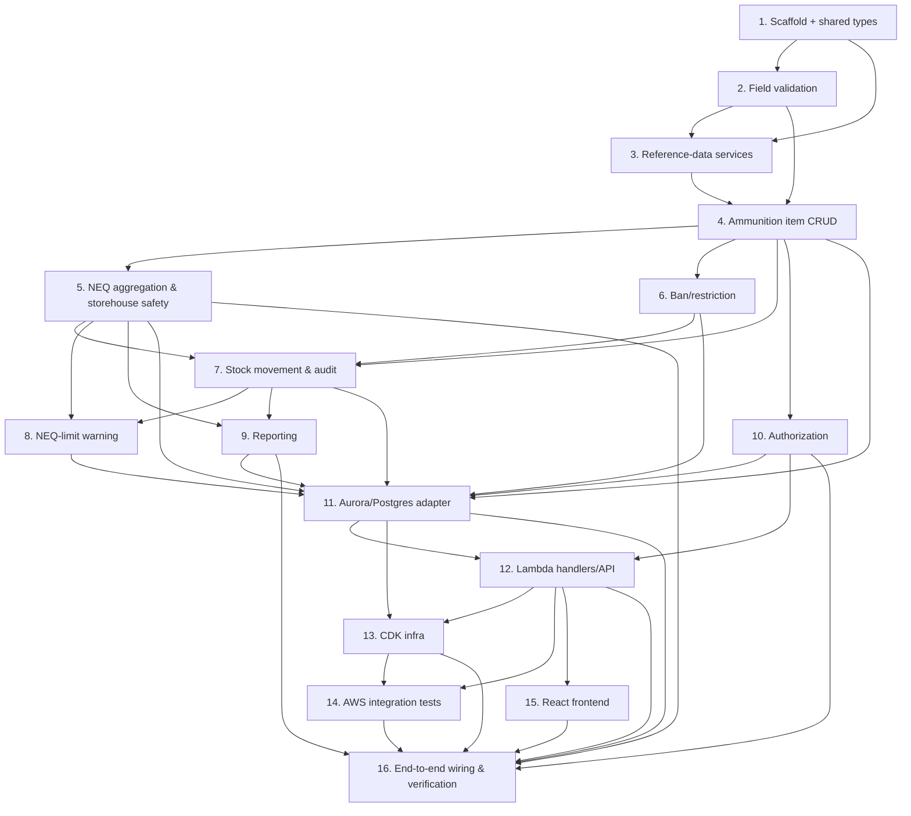

# Implementation Plan

This plan implements AIMS incrementally, building the pure, testable domain layer first (with
property-based tests per the design's testing strategy) and wiring it to AWS (Aurora Serverless v2 Postgres via RDS Proxy, API Gateway,
Lambda, Cognito, S3/CloudFront) afterward. Each task builds on prior tasks, references the
requirements it satisfies, and — where applicable — the correctness Property (P1–P46) it verifies.

Conventions:
- Property tests use `fast-check`, run ≥100 iterations, and carry a comment tag
  `Feature: aims-web, Property {n}: {property_text}`.
- The domain layer is pure TypeScript (no AWS SDK) tested against an in-memory repository fake.
- "Wire up" tasks connect already-tested domain logic to real AWS services.

## Overview

The plan builds the pure domain layer first (Tasks 2–10): field validation, reference-data services, ammunition item CRUD, NEQ aggregation and storehouse safety, ban/restriction, stock movements and audit, NEQ-limit warnings, reporting, and authorization — all validated with property-based tests against an in-memory repository fake. It then adds the Aurora/PostgreSQL persistence adapter (Task 11) behind the store-agnostic Repository interface, followed by the Lambda handlers and API surface (Task 12) and the AWS CDK infrastructure (Task 13). Finally it builds the React frontend (Task 15) and performs end-to-end wiring and verification (Task 16). Property-based tests run throughout, so each domain behavior is verified before it is wired to real AWS services.

## Tasks

- [x] 1. Scaffold the project structure and shared types
  - Create a TypeScript monorepo-style layout: `domain/` (pure logic), `adapters/` (Aurora/Postgres, Cognito, S3), `handlers/` (Lambda entrypoints), `infra/` (CDK), `web/` (React + Vite), `test/`.
  - Configure TypeScript (strict), the test runner (Vitest or Jest), and `fast-check`.
  - Define shared domain types: `AmmunitionItem`, `Manufacturer`, `Nature`, `Hcc`, `ConditionCode`, `ExplosiveStorehouse`, `StockMovement`, `AuditRecord`, `Role`, and the structured error shape `{ error: { code, message, fields[] } }`.
  - Define the `Repository` interface (item/reference/storehouse/movement/audit access + transaction assembly) so domain services depend on the interface, not on the database.
  - Implement an in-memory `Repository` fake for domain tests.
  - _Requirements: all (foundation)_

- [x] 2. Implement core field validation in the domain layer
  - [x] 2.1 Implement validators for identifier, quantity, and NEQ
    - Identifier length 1–64; Quantity integer 0–999,999,999; NEQ 0.00–999,999.99 with 2-dp rounding.
    - Return the structured `VALIDATION_ERROR` naming each offending field.
    - Write property tests for Quantity (P3) and NEQ (P4), including boundary and non-integer/non-numeric cases.
    - _Requirements: 1.3, 1.4, 1.5, 3.3, 3.4 / Properties 3, 4_
  - [x] 2.2 Implement required-field presence checks for item creation
    - Reject when Manufacturer, Nature, Identifier, Quantity, or Explosive_Storehouse is missing; error names exactly the omitted fields.
    - Write property test P2.
    - _Requirements: 1.2 / Property 2_

- [x] 3. Implement reference-data domain services (Manufacturer, Nature, HCC, Condition_Code)
  - [x] 3.1 Implement create/round-trip and length validation for reference data
    - Manufacturer name 1–200 + country 1–100 mandatory, optional fields ≤200; Nature 1–200; HCC/Condition code 1–50, description 1–500; Condition_Code carries a `serviceable` flag.
    - Write property tests P11 (manufacturer round-trip + missing mandatory) and P12 (over-length rejection).
    - _Requirements: 2.1, 2.2, 2.3, 2.4, 2.5, 2.9 / Properties 11, 12_
  - [x] 3.2 Implement case-insensitive duplicate detection and reference-in-use guard
    - Reject duplicates by lowercased key; block deletion of referenced records and report the referencing count.
    - Write property tests P15 (duplicate) and P13 (referenced cannot be deleted).
    - _Requirements: 2.6, 2.8 / Properties 13, 15_
  - [x] 3.3 Implement constrained selectable-values lookup for the item editor
    - Selectable values equal exactly the current reference set of each type.
    - Write property test P14.
    - _Requirements: 2.7 / Property 14_

- [x] 4. Implement Ammunition_Item create/update/list/delete with referential gates
  - [x] 4.1 Implement item create with HCC and Condition_Code validity gates
    - Compose field validation with HCC-exists (P5) and Condition_Code-exists (P6) checks; assign a unique id on success.
    - Write property tests P1 (valid create → unique id), P5, P6.
    - _Requirements: 1.1, 3.1, 3.2, 5.1, 5.2 / Properties 1, 5, 6_
  - [x] 4.2 Implement item update and not-found handling
    - Persist updates that satisfy Quantity/NEQ bounds; reject updates to non-existent items with `NOT_FOUND` and no data change.
    - Write property test P7 and a unit test for the non-existent-item case (1.7).
    - _Requirements: 1.6, 1.7 / Property 7_
  - [x] 4.3 Implement list with filters and full field exposure
    - Return the full field set per item; filters over {Manufacturer, Nature, Explosive_Storehouse, Condition_Code, Identifier} are sound and complete.
    - Write property tests P8 (field set) and P9 (filter soundness/completeness, incl. Condition filter 5.4).
    - _Requirements: 1.8, 1.9, 5.4 / Properties 8, 9_
  - [x] 4.4 Implement zero-quantity-gated deletion
    - Delete iff Quantity == 0; otherwise retain and return the dispose/transfer-first message.
    - Write property test P10.
    - _Requirements: 1.10, 1.11 / Property 10_

- [ ] 5. Implement NEQ aggregation and storehouse safety domain logic
  - [ ] 5.1 Implement on-demand NEQ aggregation over storehouse contents
    - Compute aggregate NEQ as the sum of `neq × quantity` across a storehouse's items (0.00 when empty) and the per-HCC breakdown by grouping on HCC; the domain layer computes these from item data via the Repository (no maintained counters).
    - Write property tests P16 (aggregate = Σ neq×qty), P17 (breakdown partitions aggregate).
    - _Requirements: 3.5, 3.6, 3.7 / Properties 16, 17_
  - [ ] 5.2 Implement storehouse create/validation, capacity, and mixed-hazard view
    - Validate name 1–100 and NEQ_Limit 0–999,999,999.99, reject duplicates; compute remaining capacity = limit − aggregate; flag mixed hazard listing distinct HCCs when ≥2 present.
    - Write property tests P18 (create/validate), P20 (remaining capacity), P21 (mixed-hazard set).
    - _Requirements: 4.1, 4.2, 4.3, 4.5, 4.6 / Properties 18, 20, 21_

- [ ] 6. Implement ban/restriction domain logic
  - Apply ban (un-banned + valid Ban_Text 1–500) sets banned + stores text + audit; reject empty/whitespace/over-length text; reject banning an already-banned item; remove ban clears state + audit; reject removal on not-banned item.
  - Write property tests P24, P25, P26, P28.
  - _Requirements: 6.1, 6.2, 6.3, 6.5, 6.6 / Properties 24, 25, 26, 28_

- [ ] 7. Implement stock movement domain logic (receipt, issue, transfer, disposal)
  - [ ] 7.1 Implement receipt, issue, and disposal quantity math with guards
    - Receipt increases quantity; issue/disposal decrease within [1, current]; reject over-stock (state available qty), reject out-of-range quantity (1–999,999,999); serviceability gate blocks issue of non-serviceable items; ban gate blocks issue/transfer returning Ban_Text.
    - Write property tests P29, P30, P31, P32, P22 (non-serviceable), P27 (banned blocks issue/transfer).
    - _Requirements: 5.5, 6.4, 7.1, 7.2, 7.3, 7.4 / Properties 22, 27, 29, 30, 31, 32_
  - [ ] 7.2 Implement transfer conservation, same-storehouse guard, and rollback semantics
    - Transfer decreases source / increases destination (conserved); reject same source/dest; on injected failure after source decrement, restore both stocks (all-or-nothing).
    - Write property tests P33 (conservation), P34 (same-storehouse), P35 (rollback via injectable fault point).
    - _Requirements: 7.5, 7.6, 7.7 / Properties 33, 34, 35_
  - [ ] 7.3 Implement the append-only audit writer and audit queries
    - Every movement/condition change appends an audit record (actor, timestamp, type, quantity, item); audit entries are immutable and count is monotonic; queries by item/storehouse return newest-first with an empty-set message.
    - Write property tests P36 (record contents), P37 (append-only), P38 (newest-first + empty), P23 (condition-change before/after audit).
    - _Requirements: 5.3, 7.8, 7.9, 7.10, 7.11 / Properties 23, 36, 37, 38_

- [ ] 8. Implement NEQ-limit warning on movements
  - After computing post-movement aggregate, still record the movement but return `NEQ_LIMIT_WARNING` with `{resultingAggregateNeq, neqLimit}` when the limit is exceeded.
  - Write property test P19.
  - _Requirements: 4.4 / Property 19_

- [ ] 9. Implement reporting domain logic
  - [ ] 9.1 Implement stockpile summary and ban report
    - Totals per storehouse (quantity + aggregate NEQ), and totals grouped by Nature and Condition_Code, equal to recomputed sums; ban report returns exactly banned items with Ban_Text.
    - Write property tests P39 and P42.
    - _Requirements: 8.1, 8.2, 8.8 / Properties 39, 42_
  - [ ] 9.2 Implement movement-history date-range report and CSV export
    - Validate range (start ≤ end, span ≤ 366 days) rejecting invalid ranges; return exactly in-range movements (empty-set indication when none); CSV has exactly one header row + one row per record and round-trips on parse; export failure aborts leaving data unchanged.
    - Write property tests P40 (range soundness/validation) and P41 (CSV structure); unit test for CSV export failure (8.7).
    - _Requirements: 8.3, 8.4, 8.5, 8.6, 8.7 / Properties 40, 41_

- [ ] 10. Implement authorization domain logic (role → permission matrix)
  - Enforce the role matrix so a user's permitted actions equal exactly their current role's permissions (Auditor cannot mutate items/movements; non-Admin cannot manage users/reference data); denied mutations leave records unchanged; attach acting user to state-change audit records and record denials with attempted action + timestamp.
  - Implement attempt-counting/lockout logic (5 consecutive failures → locked ≥15 min) against an injectable clock, plus success/failure audit entries.
  - Write property tests P44 (matrix), P45 (attribution + denial audit), P46 (auth events + lockout counting).
  - _Requirements: 9.2, 9.3, 9.4, 9.5, 9.6, 9.7, 9.8, 9.10 / Properties 44, 45, 46_

- [ ] 11. Implement the Aurora/PostgreSQL repository adapter
  - [ ] 11.1 Implement the relational schema and CRUD for items, reference data, and storehouses
    - Create the PostgreSQL schema (tables, primary/foreign keys, and indexes per the design), including case-insensitive unique indexes on `lower(name)`/`lower(code)` for duplicate detection and foreign-key-based reference-in-use counts; implement the Repository CRUD and filtered `listItems` queries.
    - _Requirements: 1.1, 1.8, 1.9, 2.6, 2.8, 4.1 (persistence)_
  - [ ] 11.2 Implement transactional movement/audit writes and on-demand aggregation queries
    - Assemble a single SQL transaction (`BEGIN`/`COMMIT`, `SELECT ... FOR UPDATE`, `quantity >= amount` guard) for item change + `stock_movement` + append-only `audit_record`; implement aggregate-NEQ / per-HCC / distinct-HCC queries with SQL aggregates; audit ordering newest-first.
    - Wire the Aurora repository into the already-tested domain services via the store-agnostic Repository interface.
    - _Requirements: 7.5, 7.7, 7.8, 7.9, 7.10 (persistence)_
  - [ ] 11.3 Add integration tests for transaction atomicity and rollback
    - Verify a forced failure mid-transaction triggers `ROLLBACK` and leaves state unchanged (against a real/local PostgreSQL), and that RDS Proxy connection handling works.
    - _Requirements: 7.7_

- [ ] 12. Implement Lambda handlers and API surface
  - [ ] 12.1 Implement handlers for inventory, reference data, NEQ/storehouse, ban, movement, audit, and reporting endpoints
    - Thin handlers: parse request → authZ guard → domain service → structured response; map domain errors to the HTTP status/code table (400/401/403/404/409/423/500 and the 200+`NEQ_LIMIT_WARNING`).
    - _Requirements: 1–8 (HTTP surface), Error Handling table_
  - [ ] 12.2 Implement user/role management handlers
    - `POST /users`, `PUT /users/{id}/role` (Admin only), applying role changes on the user's next request.
    - _Requirements: 9.2, 9.7_

- [ ] 13. Provision infrastructure with AWS CDK
  - Define the Aurora Serverless v2 (PostgreSQL) cluster with a minimum capacity of 0 ACU (scale-to-zero/auto-pause) and RDS Proxy in front for Lambda connection pooling, within a VPC; give the Lambdas VPC access to reach RDS Proxy. Define the API Gateway HTTP API with a Cognito JWT authorizer, Lambda functions, the Cognito User Pool (lockout after 5 failures, ≥15-min lock; 15-min inactivity token expiry), S3 buckets (SPA hosting + export objects), and CloudFront.
  - Enforce the append-only audit trail by granting the application database role only INSERT/SELECT (no UPDATE/DELETE) on the `audit_record` table (plus a trigger or REVOKE as defense in depth).
  - _Requirements: 7.9, 9.1, 9.8, 9.9_

- [ ] 14. Add integration tests for AWS-specific behavior
  - Verify the JWT authorizer rejects unauthenticated requests without side effects (P43); Cognito lockout (9.8) and inactivity expiry (9.9); and report SLA (<10s) on a representative dataset (8.1–8.3).
  - _Requirements: 8.1, 8.2, 8.3, 9.1, 9.8, 9.9 / Property 43_

- [ ] 15. Build the React + Vite frontend
  - [ ] 15.1 Implement authentication and session handling
    - Cognito login, JWT storage/attachment on API calls, inactivity handling and re-auth prompts.
    - _Requirements: 9.1, 9.9_
  - [ ] 15.2 Implement inventory, reference-data, storehouse, ban, movement, and reporting screens
    - Item list with filters and full field set; create/update/delete forms with field-level validation feedback; storehouse view (aggregate NEQ, limit, remaining capacity, mixed-hazard indicator); ban management; movement recording with warnings; reports with CSV download.
    - Gate UI actions by role per the permission matrix.
    - _Requirements: 1.8, 1.9, 3.5, 3.7, 4.5, 4.6, 6.1, 7.1, 8.1, 8.6, 9.2_

- [ ] 16. End-to-end wiring and verification
  - Deploy the stack, seed reference data, and run a full flow: create items → movements/transfers → NEQ aggregation → reports/CSV → audit trail, exercising role-based access across the four roles.
  - Confirm the complete property-test suite (P1–P46) passes and traceability tags are present.
  - _Requirements: all_

## Task Dependency Graph



```json
{
  "waves": [
    { "wave": 1, "tasks": ["1"] },
    { "wave": 2, "tasks": ["2"] },
    { "wave": 3, "tasks": ["3"] },
    { "wave": 4, "tasks": ["4"] },
    { "wave": 5, "tasks": ["5", "6", "10"] },
    { "wave": 6, "tasks": ["7"] },
    { "wave": 7, "tasks": ["8", "9"] },
    { "wave": 8, "tasks": ["11"] },
    { "wave": 9, "tasks": ["12", "13"] },
    { "wave": 10, "tasks": ["14", "15"] },
    { "wave": 11, "tasks": ["16"] }
  ],
  "dependencies": {
    "1": [],
    "2": ["1"],
    "3": ["1", "2"],
    "4": ["2", "3"],
    "5": ["4"],
    "6": ["4"],
    "7": ["4", "5", "6"],
    "8": ["5", "7"],
    "9": ["5", "7"],
    "10": ["4"],
    "11": ["4", "5", "6", "7", "8", "9", "10"],
    "12": ["10", "11"],
    "13": ["11"],
    "14": ["12", "13"],
    "15": ["12"],
    "16": ["11", "12", "13", "14", "15"]
  }
}
```

## Notes

- The domain layer is store-agnostic behind the `Repository` interface, so Tasks 2–10 are validated with the in-memory repository fake and `fast-check` property tests before the Aurora/PostgreSQL adapter (Task 11) exists.
- A one-time manual step is required: create the GitHub CodeConnections connection in the AWS console so the pipeline can source the repository. Additionally, the Lambda functions need VPC access to reach RDS Proxy (and thus Aurora).
